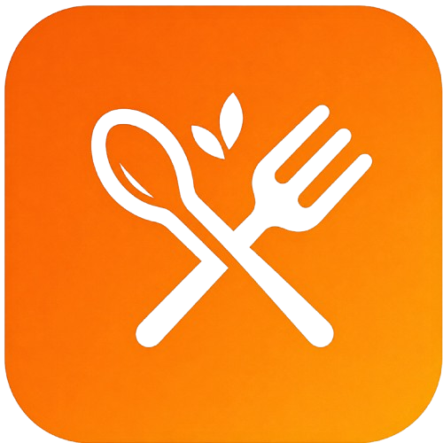
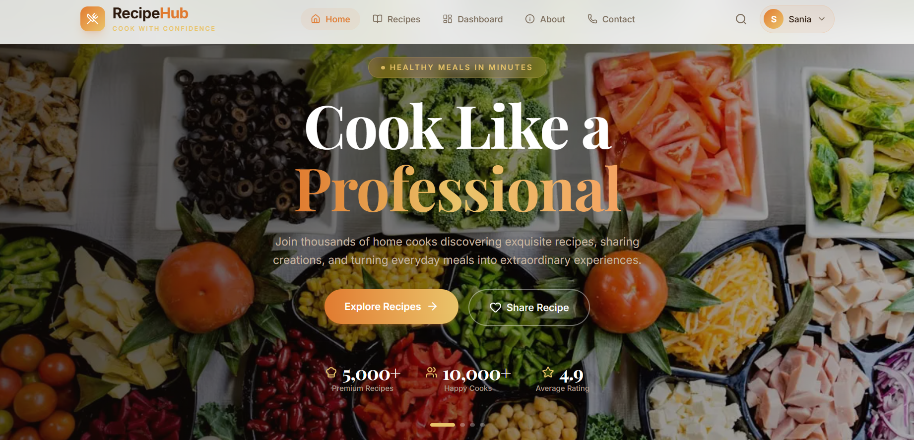

<div align="center">



# RecipeHub 

### *Discover, Cook, Share — Recipes from a Vibrant Food Community*

A full-stack recipe discovery and sharing platform where users can browse, search, filter, and manage recipes.
This repository contains the **frontend application**, built with a premium, editorial-inspired design system.

<br/>

[](https://recipe-hub-client-seven.vercel.app/)
[](https://github.com/MHJony1/RecipeHub-Client)
[](https://github.com/MHJony1/RecipeHub-Server)

<br/>


</div>

---

## 🖼️ Preview

<div align="center">

<!-- TODO: replace with real screenshot(s) -->


<sub>*Replace the image above with your own screenshot — see [Adding Your Screenshot](#-adding-your-screenshot) below.*</sub>

</div>

---

## ✨ Features

| | |
|---|---|
| 🔍 | **Explore Recipes** — Search, filter (category, difficulty, cooking time), and sort |
| 📖 | **Recipe Details** — Editorial-style layout with ingredients, steps, and related recipes |
| 🔐 | **Authentication** — Secure signup/login with JWT-based sessions |
| 🧑‍🍳 | **Dashboard** — Full CRUD for your own recipes: create, view, update, delete |
| 📊 | **Personal Stats** — Track your recipe count, categories, and activity |
| 🎨 | **Premium UI/UX** — Custom design system with smooth animations & micro-interactions |
| 📱 | **Fully Responsive** — Optimized for mobile, tablet, and desktop |

---

## 🛠️ Tech Stack

| Category | Technology |
|---|---|
| **Framework** | [Next.js](https://nextjs.org/) (App Router) |
| **Language** | TypeScript |
| **Styling** | Tailwind CSS |
| **Animation** | Framer Motion, GSAP (+ ScrollTrigger) |
| **Carousel/Sliders** | Swiper.js |
| **Forms & Validation** | React Hook Form + Zod |
| **HTTP Client** | Axios |
| **Notifications** | React Hot Toast |
| **Linting/Formatting** | ESLint, Prettier |

---

## 🚀 Getting Started

### Prerequisites

- Node.js 18+
- npm
- A running instance of the [RecipeHub backend](https://github.com/MHJony1/RecipeHub-Server)

### Installation

```bash
# Clone the repository
git clone https://github.com/MHJony1/RecipeHub-Client.git
cd RecipeHub-Client

# Install dependencies
npm install
```


### Running the App

```bash
npm run dev
```

The app will be available at [http://localhost:3000](http://localhost:3000).

---

## 📁 Project Structure

```
src/
├── app/              # Next.js App Router pages & layouts
├── components/       # Reusable UI components
│   ├── common/
│   ├── layout/
│   ├── recipe/
│   └── dashboard/
├── lib/              # Utilities, validation schemas
├── services/         # API service layer (axios calls)
└── styles/           # Global styles & design tokens
```


## 🔗 Related Repository

This is the **client** side of RecipeHub. The corresponding backend (REST API, authentication, database) lives here:

👉 **[RecipeHub-Server](https://github.com/MHJony1/RecipeHub-Server)**

Both repositories need to be running together for the full application to work.

---

## 📄 License

This project was built for educational/assignment purposes.

## 👤 Author

<div align="center">

**Mahmudul Hasan Jony**

[](https://github.com/MHJony1)

</div>
